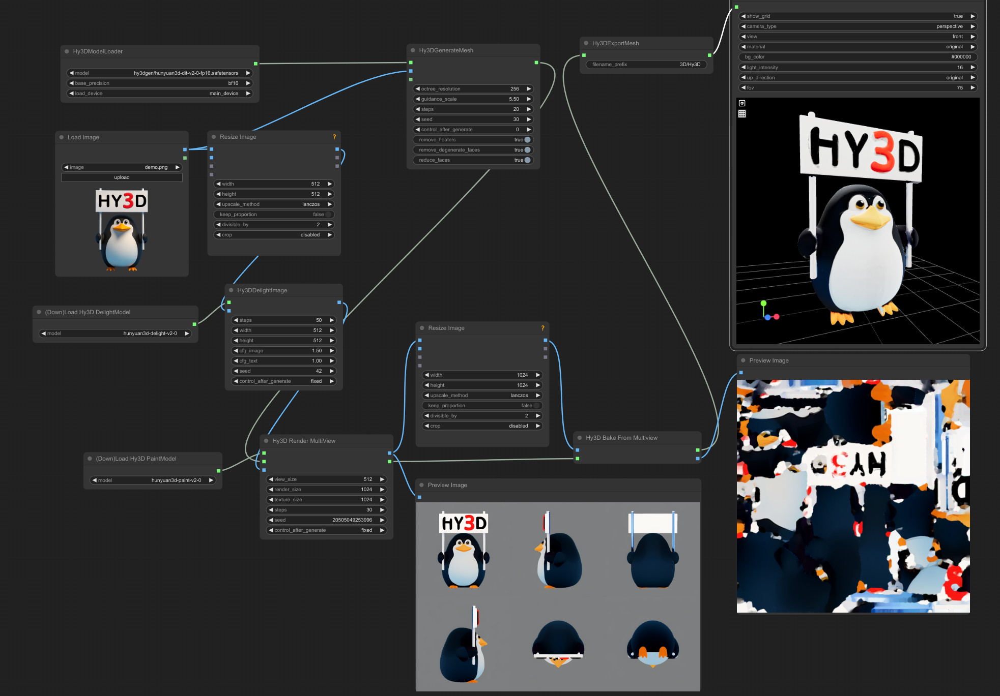

# ComfyUI wrapper for [Hunyuan3D-2](https://github.com/Tencent/Hunyuan3D-2)

# WORKINPROGRESS
# installation still messy, requires compiling for texture gen

Main model, original: https://huggingface.co/tencent/Hunyuan3D-2/blob/main/hunyuan3d-dit-v2-0/model.ckpt

Converted to .safetensors: https://huggingface.co/Kijai/Hunyuan3D-2_safetensors

to `ComfyUI/diffusion_models/`

Rest of the models are diffusers models, so they are wrapped and autodownloaded for now.


```
pip install -r requirements.txt
```

UNTESTED! For the texturegen part compilation is needed, I have included my compilations as wheels:

- Windows 11 python3.12 cu126 (works with torch build on 124)

Compilation:
cd hy3dgen/texgen/custom_rasterizer
python setup.py install
cd hy3dgen/texgen/differentiable_renderer
python setup.py install
```

